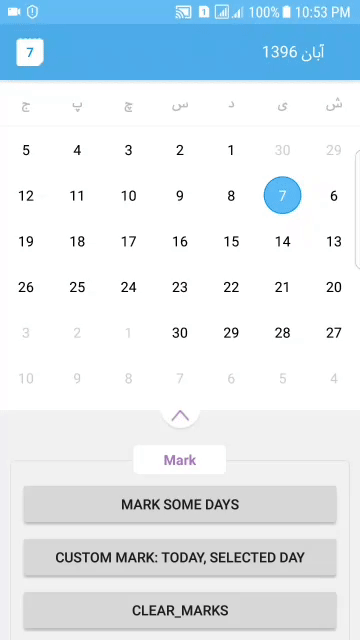
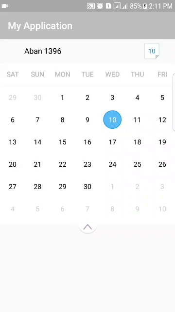
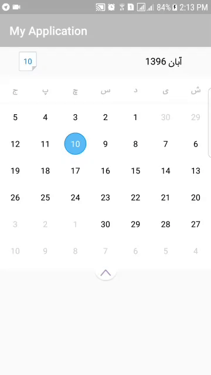
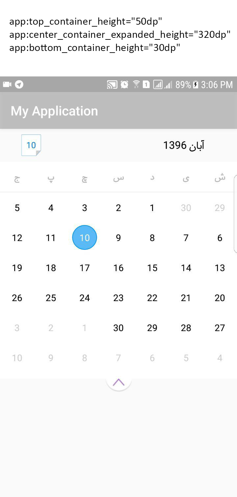
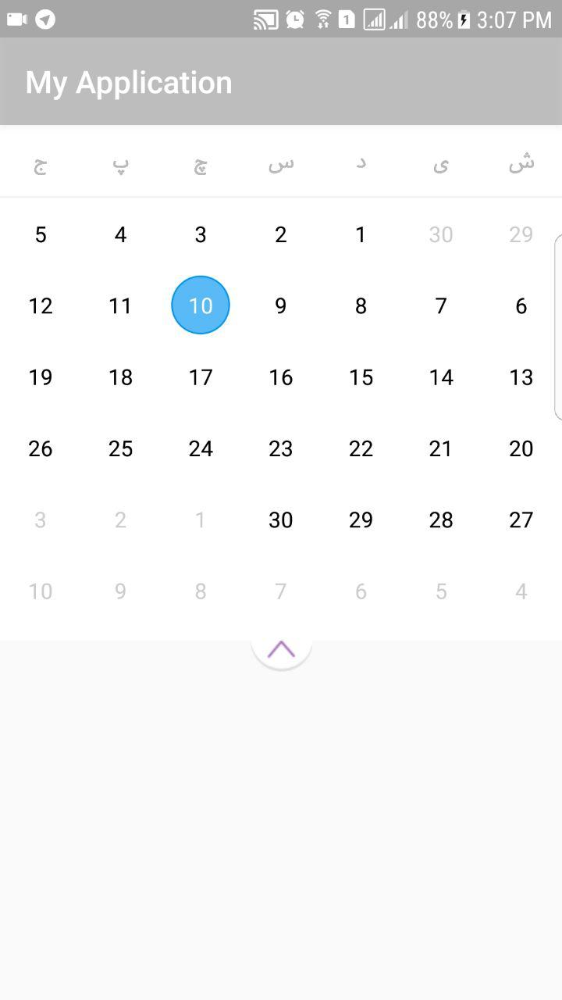
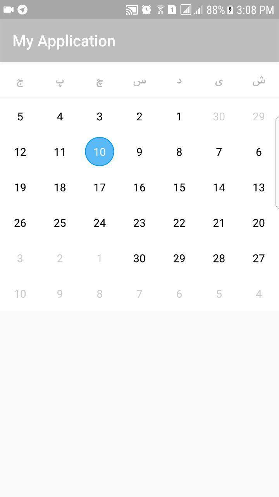
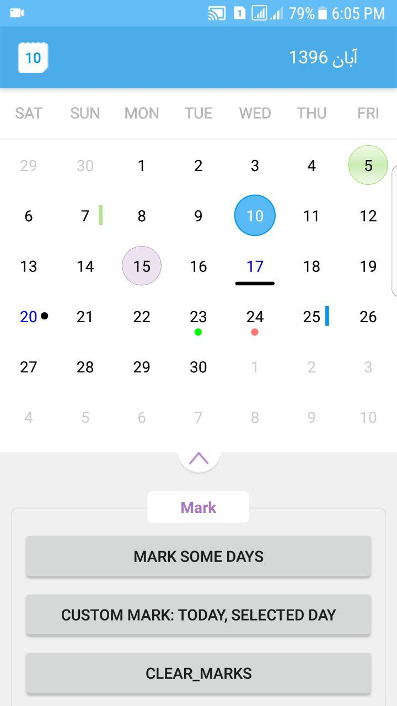
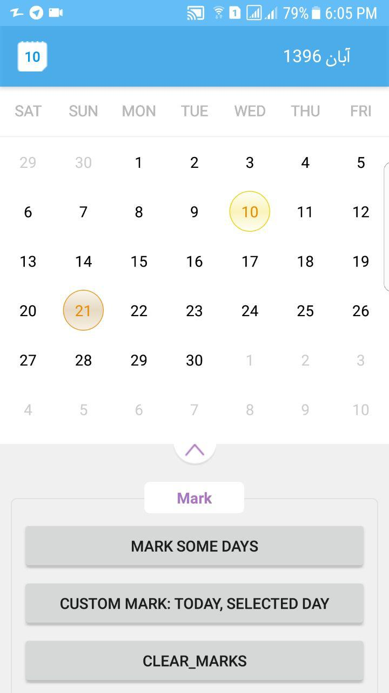

# PersianHorizontalExpCalendar

This library offers a customizable and expandable horizontal Persian calendar widget for Android 4.1 (Jelly Bean) (API 16) +.

## Screenshot


## Usage

### Download

1) Add JitPack repository in your root `build.gradle` at the end of `repositories` :

```java

allprojects {
  repositories {
      ...
      maven { url 'https://jitpack.io' }
  }
}

```
 
2) Add dependency to your root `build.gradle` :

```java
dependencies {
  ...  
  implementation 'com.github.mohamadian:PersianHorizontalExpCalendar:1.4.4'
}
```

### Call JodaTimeAndroid.init()
You must initialize the library before using it by calling `JodaTimeAndroid.init()`. I suggest putting this code in `Application.onCreate()` :

```java
public class MyApplication extends Application {
    @Override
    public void onCreate() {
        super.onCreate();
        JodaTimeAndroid.init(this);
    }
}
```

and use `MyApplication` class in `AndroidManifest.xml` like this:
```java
<manifest xmlns:android="http://schemas.android.com/apk/res/android"
    package="com.mohamadian.testapp">

    <application
        android:name=".MyApplication"
        android:allowBackup="true"
        android:icon="@mipmap/ic_launcher"
        android:label="@string/app_name"
        android:roundIcon="@mipmap/ic_launcher_round"
        android:supportsRtl="true"
        android:theme="@style/AppTheme">
        <activity android:name=".MainActivity">
            <intent-filter>
                <action android:name="android.intent.action.MAIN" />
                <category android:name="android.intent.category.LAUNCHER" />
            </intent-filter>
        </activity>
    </application>
</manifest>
```

### Add to Layout
To use PersianHorizontalExpCalendar, you need to add it in layout by using xml file.

```java
  <com.mohamadian.persianhorizontalexpcalendar.PersianHorizontalExpCalendar
      android:id="@+id/persianCalendar"
      android:layout_width="match_parent"
      android:layout_height="wrap_content"
      android:layout_alignParentLeft="true"
      android:layout_alignParentStart="true"
      android:layout_alignParentTop="true"
      app:initial_view="Week"
      app:mark_today="true"
      app:mark_selected_day="true"
      app:use_RTL_direction="true"
      app:range_months_before_init="12"
      app:range_months_after_init="12"
      app:top_container_height="0dp"
      app:center_container_expanded_height="320dp"
      app:bottom_container_height="30dp"/>
```

`app:initial_view="Week"`: Set default view to `week` view. If you want to set default view to `month` view use this `app:initial_view="Month"`

`app:use_RTL_direction="true"`: Set direction of calendar. 

LTR Direction | RLT Direction
---- | ----
 | 

`app:range_months_before_init="12"` , `app:range_months_after_init="12"`: Set range in months before and after INIT_DATE (today), values in Integer.

```java
      app:top_container_height="50dp"
      app:center_container_expanded_height="320dp"
      app:bottom_container_height="30dp"
```
You can define size of calendar containers (top, center and bottom container):

All containers | Center & bottom containers | Just center container
---- | ---- | ----
 |  | 

### Set `setPersianHorizontalExpCalListener`

* onCalendarScroll triggered after scroll, parameter dateTime is first day of current month/week
* onDateSelected triggered after select day, parameter dateTime is selected day
* onChangeViewPager triggered on expand or collapse

```java
public class MainActivity extends AppCompatActivity {

    private PersianHorizontalExpCalendar persianHorizontalExpCalendar;
    
    @Override
    protected void onCreate(Bundle savedInstanceState) {
        super.onCreate(savedInstanceState);
        setContentView(R.layout.activity_main);

        persianHorizontalExpCalendar = (PersianHorizontalExpCalendar)findViewById(R.id.persianCalendar);
        persianHorizontalExpCalendar
                .setPersianHorizontalExpCalListener(new PersianHorizontalExpCalendar.PersianHorizontalExpCalListener() {
                    @Override
                    public void onCalendarScroll(DateTime dateTime) {
                      Log.i(TAG, "onCalendarScroll: " + dateTime.toString());
                    }

                    @Override
                    public void onDateSelected(DateTime dateTime) {
                      Log.i(TAG, "onDateSelected: " + dateTime.toString());
                    }

                    @Override
                    public void onChangeViewPager(Config.ViewPagerType viewPagerType) {
                      Log.i(TAG, "onChangeViewPager: " + viewPagerType.name());
                    }
                });
}
```

### Marks
Current in library there are 5 example marks:

* Today (Blue oval, white text color)
* Selected day
* VerticalLine_Right
* SmallOval_Bottom
* CustomGradientDrawable (Customizable mark based on `GradientDrawable` class)

```java
    public void markSomeDays(){
        persianHorizontalExpCalendar
                .markDate(new DateTime(perChr).plusDays(7),
                        new CustomGradientDrawable(GradientDrawable.RECTANGLE, Color.BLACK)
                                .setViewLayoutSize(ViewGroup.LayoutParams.MATCH_PARENT,10)
                                .setViewLayoutGravity(Gravity.CENTER_HORIZONTAL | Gravity.BOTTOM)
                                .setcornerRadius(5)
                                .setTextColor(Color.BLUE))

                .markDate(new DateTime(perChr).plusDays(10),
                        new CustomGradientDrawable(GradientDrawable.OVAL, Color.BLACK)
                                .setViewLayoutSize(20,20)
                                .setViewLayoutGravity(Gravity.CENTER_VERTICAL | Gravity.RIGHT)
                                .setTextColor(Color.BLUE))

                .markDate(new DateTime(1396,8,7,0,0,perChr), Marks.CustomMarks.VerticalLine_Right, Color.parseColor("#b4e391"))

                .markDate(new DateTime(1396,8,5,0,0,perChr),
                        new CustomGradientDrawable(GradientDrawable.OVAL, new int[] {Color.parseColor("#35b4e391"), Color.parseColor("#5561c419"), Color.parseColor("#35b4e391")})
                                .setstroke(1,Color.parseColor("#62E200"))
                                .setcornerRadius(20)
                                .setTextColor(Color.parseColor("#000000")))

                .markDate(new DateTime(1396,8,15,0,0,perChr),
                        new CustomGradientDrawable(GradientDrawable.OVAL, Color.parseColor("#35a677bd"))
                                .setstroke(1,Color.parseColor("#a677bd")))

                .markDate(new DateTime(1396,8,23,0,0,perChr), Marks.CustomMarks.SmallOval_Bottom, Color.GREEN)
                .markDate(new DateTime(perChr).plusDays(14), Marks.CustomMarks.SmallOval_Bottom)
                .markDate(new DateTime(perChr).plusDays(15), Marks.CustomMarks.VerticalLine_Right)
                .updateMarks();
    }
```

do not need to call `updateMarks` if mark some dates on `OnCreate` event.

### Today & SelectedDay Custom Mark
You can set Today and SelectedDay mark to CustomGradientDrawable:

```java
    public void cutomMarkTodaySelectedDay(){
        persianHorizontalExpCalendar
                .setMarkTodayCustomGradientDrawable(new CustomGradientDrawable(GradientDrawable.OVAL, new int[] {Color.parseColor("#55fefcea"), Color.parseColor("#55f1da36"), Color.parseColor("#55fefcea")})
                        .setstroke(2,Color.parseColor("#EFCF00"))
                        .setTextColor(Color.parseColor("#E88C02")))

                .setMarkSelectedDateCustomGradientDrawable(new CustomGradientDrawable(GradientDrawable.OVAL, new int[] {Color.parseColor("#55f3e2c7"), Color.parseColor("#55b68d4c"), Color.parseColor("#55e9d4b3")})
                        .setstroke(2,Color.parseColor("#E89314"))
                        .setTextColor(Color.parseColor("#E88C02")))
                .updateMarks();
    }
```

Mark some days | Customize Today & SelectedDay mark
---- | ----
 | 

### More Customizations
You can customize `day cells` & `day labels` typeface and text color. For learn how to make more customization, please see public methods of `PersianHorizontalExpCalendar` class. You must call these methods on `OnCreate` event.

### Scroll To Date
If you what to scrool to specific date, use scrollToDate(DateTime dateTime) function in `PersianHorizontalExpCalendar` class.

```java
        Chronology perChr = PersianChronologyKhayyam.getInstance(DateTimeZone.forID("Asia/Tehran"));
        DateTime dt = new DateTime(1396,12,1,0,0,0,0,perChr);
        persianHorizontalExpCalendar
                .scrollToDate(dt);
```
or
```java
        Chronology perChr = PersianChronologyKhayyam.getInstance(DateTimeZone.forID("Asia/Tehran"));
        persianHorizontalExpCalendar
                .scrollToDate(new DateTime(perChr).plusMonths(1).plusDays(3));
```

### Credits 
This libary is based on [HorizontalExpandableCalendar-Android](https://github.com/sulo61/HorizontalExpandableCalendar-Android) and [PersianJodaTime](https://github.com/mohamadian/PersianJodaTime).

### Thanks
Special thanks to [MikeSu](https://github.com/sulo61) and [zubinkavarana](https://github.com/zubinkavarana).
